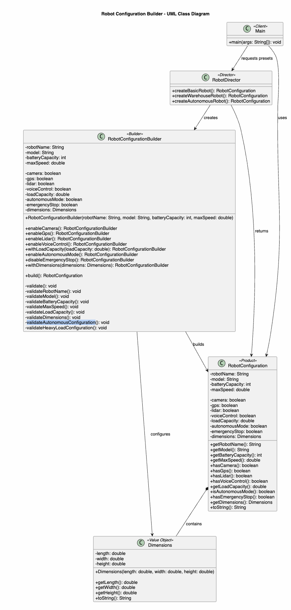

# Assignment 1 - Builder Pattern: Design Under Changing Requirements

## Course
Software Design Patterns

## Student
Myrzabekov Rakhat

## Group
SE-2518

## Instructor
Associate Professor, PhD Makpal Zhartybayeva

## Project
Robot Configuration Builder

## Programming Language
Java 17+

---

# 1. Introduction

The purpose of this project is to demonstrate the Builder Design Pattern in Java.

The selected domain is a robot configuration system. A robot contains several required and optional properties, different data types, validation rules, and dependent configuration constraints.

The project was initially implemented using a conventional constructor. This approach demonstrated several design problems related to readability, maintainability, parameter ordering, and validation.

The implementation was then refactored using the Builder Design Pattern with:

- fluent API;
- method chaining;
- default values;
- validation;
- reusable preset configurations;
- immutable Product;
- automated tests.

---

# 2. Individual Variant

**Domain:** Robot Configuration

**Individual Constraint:**  
If autonomous mode is enabled, the robot must have at least a camera or lidar.

An additional cross-field rule was also implemented:

If the robot has a load capacity greater than 50 kg, its maximum speed cannot exceed 5 m/s.

**Required Preset:** AUTONOMOUS

---

# 3. Product Description

The main Product of the system is:

`RobotConfiguration`

The Product contains 12 meaningful properties.

## Required Properties

The following four properties are required:

1. `robotName`
2. `model`
3. `batteryCapacity`
4. `maxSpeed`

## Optional Properties

The following properties are optional:

1. `camera`
2. `gps`
3. `lidar`
4. `voiceControl`
5. `loadCapacity`
6. `autonomousMode`
7. `emergencyStop`
8. `dimensions`

The implementation therefore satisfies the requirement of at least four required and six optional properties.

The Product also uses several data types:

- `String`
- `int`
- `double`
- `boolean`
- object type

The nested/value object is:

`Dimensions`

It contains:

- length;
- width;
- height.

---

# 4. Initial Constructor-Based Solution

The first implementation used a conventional constructor.

Example:

```java
Dimensions dimensions = new Dimensions(
        120,
        80,
        150
);

RobotConfiguration robot = new RobotConfiguration(
        "Warehouse Bot",
        "RX-100",
        80,
        4.5,
        true,
        true,
        true,
        false,
        60,
        true,
        true,
        dimensions
);
```

This implementation was saved in Git before introducing the Builder Pattern.

---

# 5. Problems With the Constructor-Based Design

## Problem 1 - Poor Readability

The constructor contains many parameters.

For example:

```java
true,
true,
true,
false,
60,
true,
true
```

It is impossible to understand the meaning of these values without checking the constructor declaration.

A developer cannot immediately see whether a boolean value represents camera, GPS, lidar, autonomous mode, or another property.

---

## Problem 2 - Parameter Order

Several parameters use identical data types.

For example, the constructor contains several consecutive boolean and numeric arguments.

This increases the risk of passing values in the wrong order.

The compiler may not detect the problem if the exchanged parameters use the same type.

---

## Problem 3 - Difficult Maintenance

If another optional property is introduced, the constructor may need another parameter.

This can require modifications in existing Client code.

Therefore, the constructor approach becomes harder to maintain as requirements change.

---

## Problem 4 - Validation Complexity

The robot contains validation rules involving both individual properties and dependencies between properties.

Placing all this logic around one large constructor would make the code difficult to understand and maintain.

The Builder allows the construction and validation processes to be organized separately.

---

# 6. Builder Solution

The constructor-based implementation was refactored using the Builder Design Pattern.

The main Builder is:

`RobotConfigurationBuilder`

Required properties are passed when the Builder is created:

```java
RobotConfigurationBuilder builder =
        new RobotConfigurationBuilder(
                "Autonomous Bot",
                "AUTO-X",
                95,
                5.0
        );
```

Optional properties are configured using descriptive methods.

Example:

```java
RobotConfiguration robot =
        new RobotConfigurationBuilder(
                "Autonomous Bot",
                "AUTO-X",
                95,
                5.0
        )
                .enableCamera()
                .enableGps()
                .enableLidar()
                .enableVoiceControl()
                .enableAutonomousMode()
                .withLoadCapacity(40)
                .build();
```

The final Product is created by:

```java
build()
```

---

# 7. Fluent API and Method Chaining

The Builder supports method chaining.

Each configuration method returns the current Builder instance.

Example:

```java
public RobotConfigurationBuilder enableCamera() {
    this.camera = true;
    return this;
}
```

Because the method returns `this`, another Builder operation can be called immediately.

Example:

```java
builder
        .enableCamera()
        .enableGps()
        .enableLidar()
        .enableAutonomousMode()
        .build();
```

This creates a readable fluent API.

---

# 8. Meaningful Default Values

Optional properties have default values.

```text
camera = false
gps = false
lidar = false
voiceControl = false
loadCapacity = 0.0
autonomousMode = false
emergencyStop = true
dimensions = 100 x 60 x 120 cm
```

These defaults allow a simple configuration to be created without specifying every optional property.

The Client only needs to configure properties that are different from the defaults.

---

# 9. Builder Pattern Participants

| Builder Role | Class | Responsibility |
|---|---|---|
| Product | `RobotConfiguration` | Represents the final immutable robot configuration |
| Builder | `RobotConfigurationBuilder` | Stores parameters, validates configuration and creates Product |
| Client | `Main` | Requests and uses robot configurations |
| Director | `RobotDirector` | Defines reusable preset configurations |
| Value Object | `Dimensions` | Represents physical dimensions of the robot |

---

# 10. Validation

The Builder must not create an invalid Product.

Validation is executed during:

```java
build()
```

Implementation:

```java
public RobotConfiguration build() {
    validate();
    return new RobotConfiguration(this);
}
```

If validation fails, an exception is thrown and the Product is not created.

---

# 11. Single-Field Validation Rules

The project contains more than the required three single-field validation rules.

## Rule 1 - Robot Name

The robot name cannot be null or blank.

```java
private void validateRobotName() {
    if (robotName == null || robotName.isBlank()) {
        throw new IllegalArgumentException(
                "Robot name cannot be blank"
        );
    }
}
```

## Rule 2 - Robot Model

The model cannot be null or blank.

## Rule 3 - Battery Capacity

Battery capacity must be between 1 and 100.

```java
private void validateBatteryCapacity() {
    if (batteryCapacity < 1 || batteryCapacity > 100) {
        throw new IllegalArgumentException(
                "Battery capacity must be between 1 and 100"
        );
    }
}
```

## Rule 4 - Maximum Speed

Maximum speed must be greater than 0 and cannot exceed 20.

## Rule 5 - Load Capacity

Load capacity cannot be negative.

## Rule 6 - Dimensions

Dimensions cannot be null.

---

# 12. Cross-Field Validation Rules

## Rule 1 - Autonomous Robot

An autonomous robot must have at least a camera or lidar.

Dependency:

```text
autonomousMode = true
        |
        v
camera OR lidar required
```

Implementation:

```java
private void validateAutonomousConfiguration() {
    if (autonomousMode && !camera && !lidar) {
        throw new IllegalStateException(
                "Autonomous robot requires a camera or lidar"
        );
    }
}
```

This is the main individual constraint of the project.

---

## Rule 2 - Heavy Load

A robot carrying more than 50 kg cannot have a maximum speed greater than 5 m/s.

Dependency:

```text
loadCapacity > 50
        |
        v
maxSpeed <= 5
```

Implementation:

```java
private void validateHeavyLoadConfiguration() {
    if (loadCapacity > 50 && maxSpeed > 5) {
        throw new IllegalStateException(
                "Robots carrying more than 50 kg cannot exceed 5 m/s"
        );
    }
}
```

This is a cross-field validation because the validity of `maxSpeed` depends on `loadCapacity`.

---

# 13. Why Validation Is Performed in the Builder

The Builder controls the construction process.

Validation is therefore performed immediately before the final Product is created.

The construction process is:

```text
Client
   |
   v
Builder
   |
   v
Configuration
   |
   v
build()
   |
   v
Validation
   |
   +---- Invalid ----> Exception
   |
   v
RobotConfiguration
```

This prevents invalid `RobotConfiguration` objects from being created.

The Product can remain simple and immutable.

---

# 14. Preset Configurations

The project contains three substantially different configurations.

They are implemented in:

`RobotDirector`

---

## BASIC

The BASIC preset represents a simple robot.

Main configuration:

```text
Name: Basic Bot
Model: RB-10
Battery: 40
Maximum Speed: 3.0
Load Capacity: 10
Autonomous Mode: false
```

It uses minimal optional functionality.

---

## WAREHOUSE

The WAREHOUSE preset represents a robot designed for warehouse operations.

Main configuration:

```text
Name: Warehouse Bot
Model: WH-200
Battery: 85
Maximum Speed: 4.0
Camera: enabled
GPS: enabled
Load Capacity: 80
```

Because the load capacity is greater than 50 kg, the speed remains below the maximum allowed value of 5 m/s.

---

## AUTONOMOUS

The AUTONOMOUS preset represents a robot designed for autonomous operation.

Main configuration:

```text
Name: Autonomous Bot
Model: AUTO-X
Battery: 95
Maximum Speed: 5.0
Camera: enabled
GPS: enabled
Lidar: enabled
Voice Control: enabled
Autonomous Mode: enabled
Load Capacity: 40
```

This preset satisfies the individual autonomous-mode constraint.

---

# 15. Director

The project uses:

`RobotDirector`

The Director contains reusable construction sequences.

Example:

```java
RobotConfiguration autonomousRobot =
        RobotDirector.createAutonomousRobot();
```

Without the Director, the Client would have to repeat the same Builder sequence every time the AUTONOMOUS configuration is required.

The Director therefore improves reuse and reduces duplication.

---

# 16. UML Diagram

The UML diagram represents the actual implementation.



The diagram includes:

- Client;
- Director;
- Builder;
- Product;
- Value Object;
- relationships between classes.

The main relationships are:

```text
Main
  |
  v
RobotDirector
  |
  v
RobotConfigurationBuilder
  |
  v
RobotConfiguration
  |
  v
Dimensions
```

---

# 17. Clean Code Principles

The implementation applies several principles from Clean Code Chapter 3.

The main principles used are:

1. Small Functions
2. One Function - One Responsibility
3. Descriptive Naming
4. Avoiding Flag Arguments
5. Minimizing Function Arguments
6. DRY
7. Clear Error Handling
8. One Level of Abstraction

---

# 18. Clean Code Before -> After: Example 1

## BEFORE

The initial constructor required many arguments:

```java
RobotConfiguration robot = new RobotConfiguration(
        "Warehouse Bot",
        "RX-100",
        80,
        4.5,
        true,
        true,
        true,
        false,
        60,
        true,
        true,
        dimensions
);
```

## What Was Wrong?

The constructor had many arguments and several boolean flags.

Values such as:

```java
true, true, false
```

do not clearly explain their meaning.

## Principles Applied

- minimizing function arguments;
- avoiding flag arguments;
- descriptive naming.

## AFTER

```java
RobotConfiguration robot =
        new RobotConfigurationBuilder(
                "Warehouse Bot",
                "WH-200",
                85,
                4.0
        )
                .enableCamera()
                .enableGps()
                .withLoadCapacity(80)
                .withDimensions(
                        new Dimensions(120, 80, 150)
                )
                .build();
```

## Why Is It Better?

The Client code clearly communicates which features are enabled.

The construction process is easier to read and modify.

---

# 19. Clean Code Before -> After: Example 2

## BEFORE

Validation could be placed in one large block:

```java
if (robotName == null || robotName.isBlank()
        || model == null || model.isBlank()
        || batteryCapacity < 1
        || batteryCapacity > 100
        || maxSpeed <= 0) {
    throw new IllegalArgumentException();
}
```

## What Was Wrong?

This code performs several responsibilities in one block.

It is also difficult to understand which property caused the error.

## Principles Applied

- small functions;
- one function - one responsibility;
- clear error handling;
- one level of abstraction.

## AFTER

```java
private void validate() {
    validateRobotName();
    validateModel();
    validateBatteryCapacity();
    validateMaxSpeed();
    validateLoadCapacity();
    validateDimensions();

    validateAutonomousConfiguration();
    validateHeavyLoadConfiguration();
}
```

Each method checks one specific rule.

## Why Is It Better?

The validation logic is easier to understand, modify, test, and debug.

Each validation function also provides a meaningful error message.

---

# 20. Clean Code Before -> After: Example 3

## BEFORE

A preset could be created directly in Client code every time:

```java
RobotConfiguration robot =
        new RobotConfigurationBuilder(
                "Autonomous Bot",
                "AUTO-X",
                95,
                5.0
        )
                .enableCamera()
                .enableGps()
                .enableLidar()
                .enableVoiceControl()
                .enableAutonomousMode()
                .withLoadCapacity(40)
                .build();
```

Repeating the same sequence in different places would duplicate construction logic.

## Principle Applied

DRY - Don't Repeat Yourself.

## AFTER

```java
RobotConfiguration robot =
        RobotDirector.createAutonomousRobot();
```

## Why Is It Better?

The preset configuration has one reusable definition.

If the AUTONOMOUS preset changes, only the Director needs modification.

---

# 21. Design Decision

## Decision

The final Product, `RobotConfiguration`, is immutable.

Its fields are declared as:

```java
private final
```

and the class does not provide setter methods.

---

## Alternative

Another possible implementation would use a mutable Product with setter methods.

For example:

```java
robot.setBatteryCapacity(20);
robot.setAutonomousMode(true);
```

---

## Reasoning

The mutable approach was rejected because a valid Product could become invalid after it was built.

For example, an autonomous robot could initially satisfy its sensor requirements and later be modified into an invalid state.

With an immutable Product, configuration values cannot be changed after successful construction.

This ensures that a validated `RobotConfiguration` remains valid.

---

# 22. Automated Testing

The project uses JUnit 5.

The test class is:

`RobotConfigurationBuilderTest`

The assignment requires at least 10 tests.

The project currently contains 12 automated tests.

---

# 23. Valid Construction Tests

Three valid scenarios are tested:

```text
BASIC
WAREHOUSE
AUTONOMOUS
```

The tests verify that valid Products are successfully built and contain expected values.

---

# 24. Invalid Construction Tests

Invalid configurations are also tested.

Examples include:

```text
blank robot name
battery capacity outside valid range
negative load capacity
autonomous robot without camera or lidar
heavy robot exceeding allowed speed
```

JUnit `assertThrows()` is used to verify that invalid configurations fail predictably.

---

# 25. Boundary Tests

Battery capacity has the valid range:

```text
1 <= batteryCapacity <= 100
```

Tests verify both boundaries:

```text
batteryCapacity = 1
batteryCapacity = 100
```

Both values must be accepted.

The heavy-load speed rule is also tested at:

```text
maxSpeed = 5.0
```

when:

```text
loadCapacity > 50
```

This value must remain valid.

---

# 26. Individual Constraint Test

The individual constraint is tested by creating an autonomous robot without a camera or lidar.

Example:

```java
new RobotConfigurationBuilder(
        "Autonomous Robot",
        "AUTO-1",
        90,
        4
)
        .enableAutonomousMode()
        .build();
```

This configuration must throw:

```java
IllegalStateException
```

because an autonomous robot requires a camera or lidar.

---

# 27. Builder Reuse and Product Independence

The same Builder can be reused to create another Product.

Example:

```java
RobotConfigurationBuilder builder =
        new RobotConfigurationBuilder(
                "Reusable Bot",
                "RB-5",
                70,
                4
        );

RobotConfiguration firstRobot =
        builder.build();

RobotConfiguration secondRobot =
        builder
                .enableCamera()
                .enableGps()
                .build();
```

Expected result:

```text
firstRobot:
camera = false
gps = false

secondRobot:
camera = true
gps = true
```

The first Product is not changed when the Builder is modified.

This demonstrates Product independence.

---

# 28. Testing Result

All automated tests pass successfully.

Expected result:

```text
Tests passed: 12
Failures: 0
```

The tests verify behavior instead of simply executing methods.

---

# 29. Sample Program Output

Example program output:

```text
=== BASIC ROBOT ===
RobotConfiguration{robotName='Basic Bot', model='RB-10', batteryCapacity=40, maxSpeed=3.0, camera=false, gps=false, lidar=false, voiceControl=false, loadCapacity=10.0, autonomousMode=false, emergencyStop=true, dimensions=80.0 x 50.0 x 100.0 cm}

=== WAREHOUSE ROBOT ===
RobotConfiguration{robotName='Warehouse Bot', model='WH-200', batteryCapacity=85, maxSpeed=4.0, camera=true, gps=true, lidar=false, voiceControl=false, loadCapacity=80.0, autonomousMode=false, emergencyStop=true, dimensions=120.0 x 80.0 x 150.0 cm}

=== AUTONOMOUS ROBOT ===
RobotConfiguration{robotName='Autonomous Bot', model='AUTO-X', batteryCapacity=95, maxSpeed=5.0, camera=true, gps=true, lidar=true, voiceControl=true, loadCapacity=40.0, autonomousMode=true, emergencyStop=true, dimensions=100.0 x 70.0 x 130.0 cm}

AUTONOMOUS configuration built successfully 🍌
```

The banana symbol is printed for exactly one successfully built configuration as required by the assignment.

---

# 30. Project Structure

```text
assignment1builder/
│
├── src/
│   ├── main/
│   │   └── java/
│   │       └── kz/
│   │           └── aitu/
│   │               └── builder/
│   │                   ├── app/
│   │                   │   └── Main.java
│   │                   │
│   │                   ├── director/
│   │                   │   └── RobotDirector.java
│   │                   │
│   │                   └── model/
│   │                       ├── Dimensions.java
│   │                       ├── RobotConfiguration.java
│   │                       └── RobotConfigurationBuilder.java
│   │
│   └── test/
│       └── java/
│           └── kz/
│               └── aitu/
│                   └── builder/
│                       └── RobotConfigurationBuilderTest.java
│
├── docs/
│   └── builder-uml.png
│
├── README.md
├── report.md
└── pom.xml
```

---

# 31. Git Development History

The repository demonstrates development instead of containing only one final commit.

The development process includes meaningful commits such as:

```text
feat: add constructor-based robot configuration

refactor: introduce builder for robot configuration

test: expand cross-field validation coverage

docs: add project README

docs: add Builder UML diagram

docs: add assignment report and design analysis
```

The Git history demonstrates the transition from the initial constructor implementation to the final Builder-based architecture.

---

# 32. Technologies

The project uses:

```text
Java 17+
Maven
JUnit 5
IntelliJ IDEA
Git
GitHub
PlantUML
```

---

# 33. Conclusion

The project demonstrates the Builder Design Pattern using a robot configuration system.

The initial constructor-based solution demonstrated several design problems:

- poor readability;
- many arguments;
- unclear boolean values;
- dependency on parameter order;
- difficult validation;
- harder maintenance.

The Builder Pattern improves the design by providing:

- step-by-step construction;
- fluent API;
- method chaining;
- descriptive domain-oriented methods;
- meaningful default values;
- centralized validation;
- reusable presets;
- immutable Product;
- automated testing.

The final design can also respond more easily to changing requirements.

For example, a new optional sensor, validation rule, or preset configuration can be introduced without replacing the whole construction process.

---

# 34. GitHub Repository

GitHub Repository:

```text
https://github.com/Rakhichhh/assignment-1-builder
```
